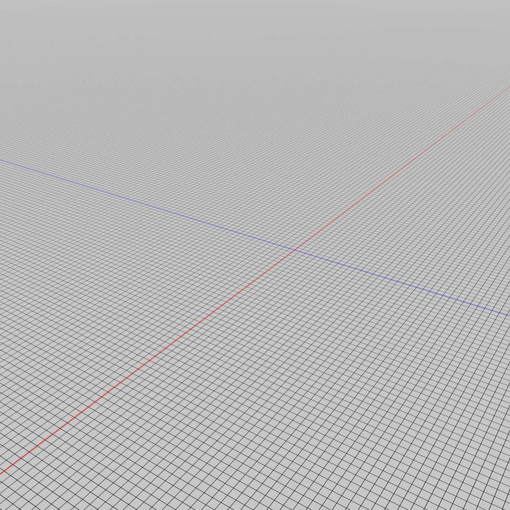
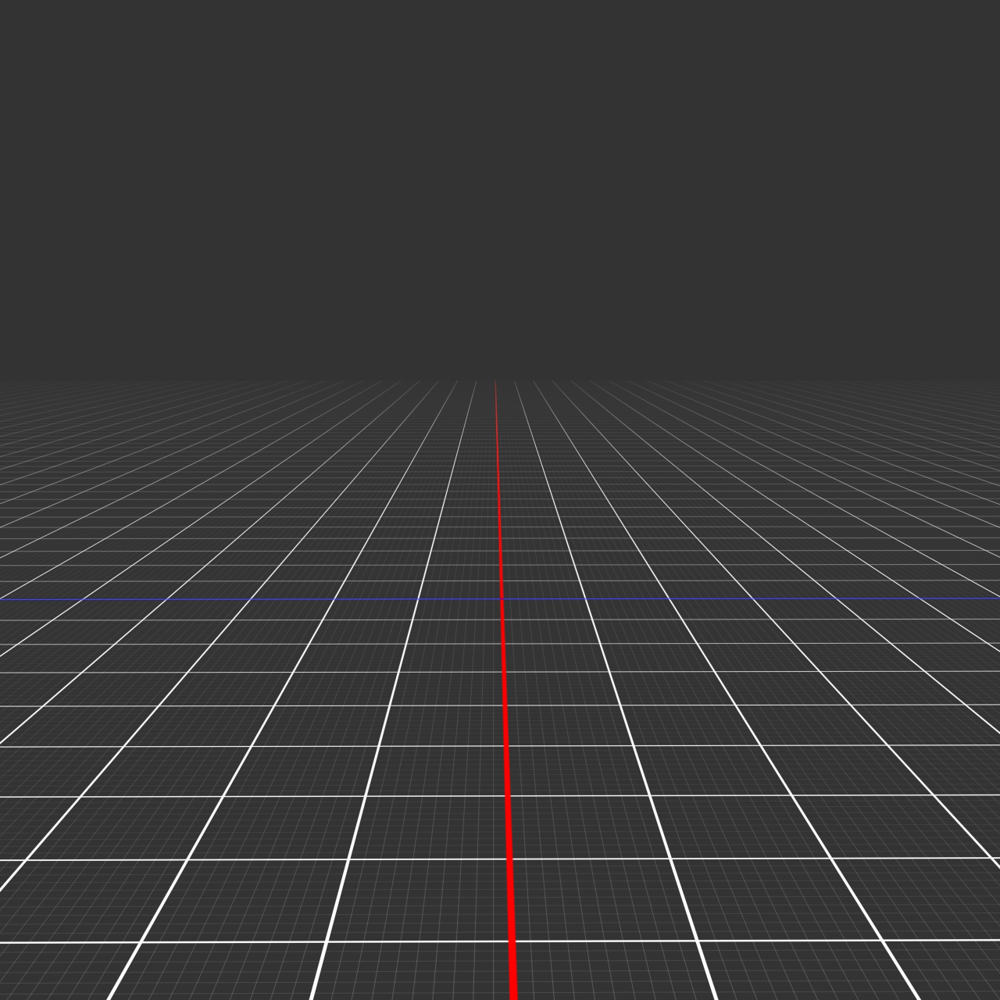
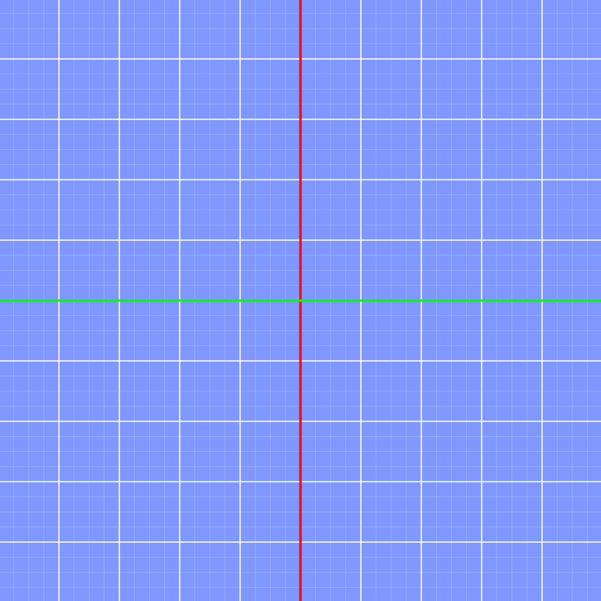

# Infinite Grid in TouchDesigner

A resolution-independent, anti-aliased infinite grid rendered via GLSL shaders in TouchDesigner. Based on the [pristine grid technique by Ben Golus](https://bgolus.medium.com/the-best-darn-grid-shader-yet-727f9278b9d8).

<p align="center">
  
</p>

## Project Structure

```
├── grid.toe                # Full runnable project
└── src/
    └── glsl/
        ├── pixel.glsl      # Fragment shader — grid rendering
        └── vertex.glsl     # Vertex shader — world space transform
```

## Requirements

- TouchDesigner 2023.11760 or later
- GPU with OpenGL 4.3+ support

## Usage

### Open full project

Open `grid.toe` in TouchDesigner. 

### Import as component

Drag `tox/Project.tox` into any TouchDesigner project to use the particle system as a standalone module. Need to move the `src` files accordingly. The grid renders on a rectangle SOP through a GLSL MAT. Use the `cameraViewport` to navigate — left-click to tumble, right-click to pan, scroll to dolly. Press `h` to home the camera.

## License

MIT
